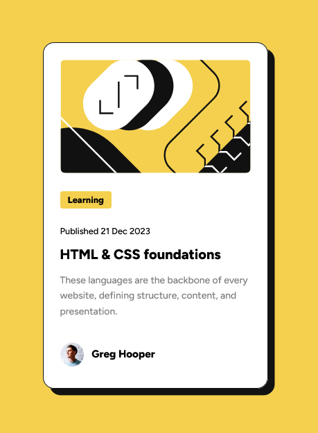

# Frontend Mentor - Blog preview card solution

This is a solution to the [Blog preview card challenge on Frontend Mentor](https://www.frontendmentor.io/challenges/blog-preview-card-ckPaj01IcS). Frontend Mentor challenges help you improve your coding skills by building realistic projects. 

## Table of contents

- [Overview](#overview)
  - [The challenge](#the-challenge)
  - [Screenshot](#screenshot)
  - [Links](#links)
  - [Built with](#built-with)
  - [What I learned](#what-i-learned)
  - [Continued development](#continued-development)
- [Author](#author)

## Overview

### The challenge

Users should be able to:

- See hover and focus states for all interactive elements on the page

### Screenshot

### Links

- Live Site URL: [Live preview](https://divadovitch.github.io/blog-preview-card-main/){:target="_blank"}

### Built with

- Semantic HTML5 markup
- CSS custom properties
- Flexbox

### What I learned

To use flexbox to justifiy and align the elements, to fill an image without deformation, to use inline-block to have a specific size for a paragraph.

### Continued development

Where to put the :hover and :focus for better accessibility, adding variables for spacing. 

## Author

- Frontend Mentor - [Divadovitch](https://www.frontendmentor.io/profile/Divadovitch){:target="_blank"}